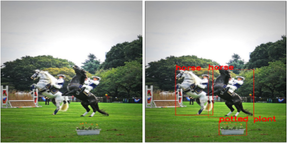
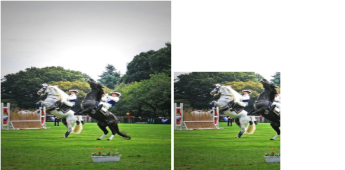
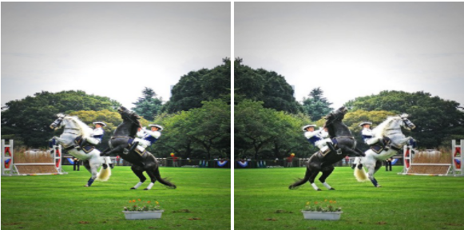
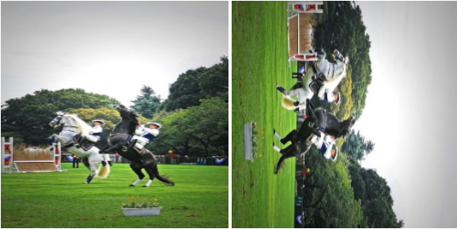
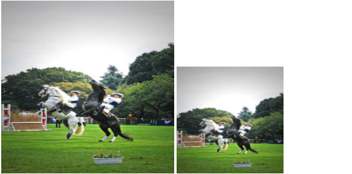
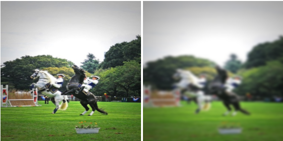

# Image Detector Using OOPs
 Created a model using Object Oriented Programming that detects objects in images

Also, packeaged it into a module that can be installed using
<br>
<b>pip install my-package-19CS10039==0.0.1</b>


# Software Lab 

## Python Datascience Assignment

In this assignment we will deal with **Object detection**. Object detection is a very well studied task of Deep Learning, having tremendous variety of applications. You have to create a python package for transforming images and analysing their effect on the predictions of an object detector. We are providing you with a pretrained object detector, all you need to do is to call the detector on the image and get the outputs.

A python package means that one can install the package in the python environment and can import the modules in any python script, irrespective of the location of the script. Creating a python package is fairly easy, just follow the steps [here](https://packaging.python.org/tutorials/packaging-projects/).

The details of each of the files/folders are as follows:

1. `main.py`: This is the main file which is to be called to execute the program. The main file calls the corresponding functions as needed while execution. The main file should call the appropriate function to prepare the dataset, then transform the images read, obtain the bounding boxes of the objects present in the image by calling the detector model, and then plot the obtained images by calling the appropriate functions from the package described below.

2. `./my_package/model.py`: This file contains the object-detection model definition. Consider it as a black-box model which takes an image (as numpy array) as input and provides the bounding box outputs and the corresponding class labels as for the input image.

&nbsp;
<p align="center">

</p>
<p align="center">
<b>Fig. 1</b>. Sample Output of an Object Detector. </p>
&nbsp;


3. `./my_package/data/dataset.py`: This file contains the class ```Dataset``` that reads the provided dataset from the annotation file and provides the numpy version of the images which are to be transformed and forwarded through the model. The annotation format is provided in `data/README.md`

4. `./my_package/data/transforms`: This folder contains 5 files. Each of these files is responsible for performing the corresponding transformation, as follows:
	
a) `crop.py`: This file takes an image (as numpy array) as input and crops it based on the provided arguments. Declare a class `CropImage()` for performing the operation. 

&nbsp;
<p align="center">

</p>
<p align="center">
<b>Fig. (a)</b>. Crop Operation. </p>
&nbsp;
	
b) `flip.py`: This file takes an image (as numpy array) as input and flips it based on the provided arguments. Declare a class `FlipImage()` for performing the operation. 

&nbsp;
<p align="center">

</p>
<p align="center">
<b>Fig. (b)</b>. Flip Operation. </p>
&nbsp;
	
c) `rotate.py`: This file takes an image (as numpy array) as input and rotates it based on the provided arguments. Declare a class `RotateImage()` for performing the operation. 

&nbsp;
<p align="center">

</p>
<p align="center">
<b>Fig. (c)</b>. Rotate Operation. </p>
&nbsp;

d) `rescale.py`: This file takes an image (as numpy array) as input and rescales it based on the provided arguments. Declare a class `RotateImage()` for performing the operation. 

&nbsp;
<p align="center">

</p>
<p align="center">
<b>Fig. (d)</b>. Rescale Operation. </p>
&nbsp;

e) `blur.py`: This file takes an image (as numpy array) as input and applies a gaussian blur to it based on the provided arguments. Declare a class `GaussBlurImage()` for performing the operation. 

&nbsp;
<p align="center">

</p>
<p align="center">
<b>Fig. (e)</b>. Blur Operation. </p>
&nbsp;

5. `./my_package/analysis/visualize.py`: This file defines a function that draws the image with the predicted bounding boxes (with the corresponding labels) on the image and saves them in the specified output folder.

6. `setup.py`: Use this file for constructing the package `my_package`.
